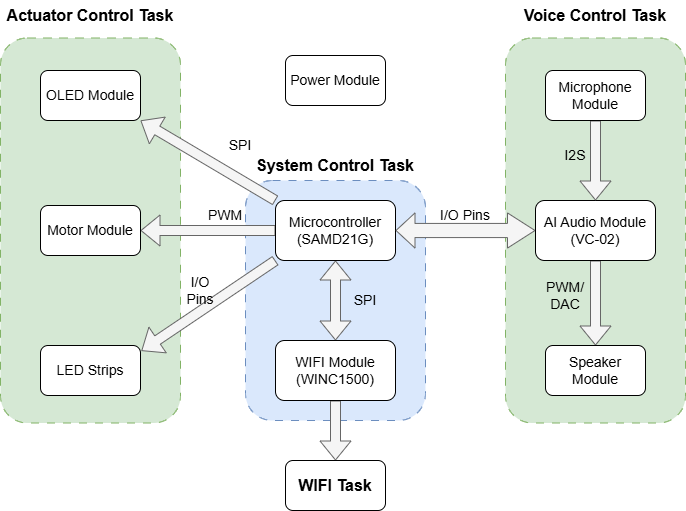
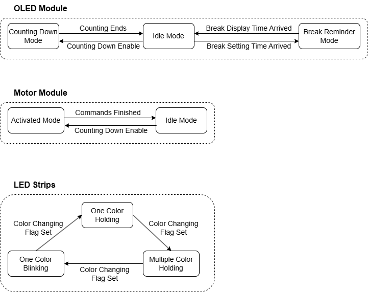

# a07g-exploring-the-CLI

* Team Number: T23
* Team Name: Good Night
* Team Members: Zeng Li, Haichao Zhao
* GitHub Repository URL: https://github.com/ese5160/final-project-a07g-a14g-t23-good-night.git
* Description of test hardware: Laptop, ROG M16, windows11

## 0. Install Percepio

## 1. Software Architecture
### 1.1 Hardware Requirements Specification (HRS)
#### 1.1.1 Overview
The Electronic Pet is a kind of desktop product, entertaining users in their daily life. It is controlled by MCU: SAMD21G, able to display real-time clock based on RTC chip, moving around with wheels controlled by mobile app or human voice, etc.

#### 1.1.2 Users
Primary users of this project include:
* Technology enthusiasts interested in innovative human-computer interaction
* Individuals seeking a more engaging and entertaining way to interact with their computers
  
#### 1.1.3 Definitions, Abbreviations
* Micro Controller Unit: MCU
* Organic Light Emitting Diode: OLED
* Real Time Clock: RTC

#### 1.1.4 Functionality
* HRS 01 - Project shall be based on SAMW25 microcontroller.
* HRS 02 - A 39x41x3.3mm OLED shall be used as user interface. 
* HRS 03 - The Electronic Pet shall move around with wheels controlled by PWM signals(≥20kHz frequency).
* HRS 04 - The project shall utilize a microphone to capture users' voice command.
* HRS 05 - The project shall utilize a speaker to play audio signals.
* HRS 06 - The Electronic Pet shall have colorful lightning effect by using led strips based on I/O pins sending color data.
* HRS 07 - The Electronic Pet shall using 1-cell Li-Po battery with normal voltage 3.7V to power itself.
* HRS 08 - The Elctronic Pet shall have a hardware audio weak-up button to activate voice detection functionality.
* HRS 09 - The Elctronic Pet shall have a switch to allow firmware downloaded between MCU and AI voice module.
* HRS 10 - The Elctronic Pet shall have a reset button to reset MCU.
  
### 1.2. Software Requirements Specification (SRS)
#### 1.2.1 Overview
The Electronic Pet is a kind of desktop product, entertaining users in their daily life. It can show animations (including music animation, counting down animation, etc.) in the OLED. It has programmable light show and can communicate with users by voice.

#### 1.2.2 Users
Primary users of this project include:
* Technology enthusiasts interested in innovative human-computer interaction
* Individuals seeking a more engaging and entertaining way to interact with their computers

#### 1.3.3 Definitions, Abbreviations
* Micro Controller Unit: MCU
* Organic Light Emitting Diode: OLED

#### 1.4.4 Functionality
* SRS 01 - The OLED shall show real time clock with time changing animation under idle mode.
* SRS 02 - The Electronic Pet shall count down time, set by users' voice command(all voice ommand response time ≤100ms and all voice recognition accuracy ≥95%).
* SRS 03 - The OLED shall show time counting down changing animation.
* SRS 04 - The project shall control LED strip to display several modes: blinking with one color in 0.5 milisecond period, holding in one color, holding in multiple colors.
* SRS 05 - The Electronic Pet shall move forward, move backward, turn left and turn right based on users' voice command or mobile application control.
* SRS 06 - The Electronic Pet shall remind users to take breaks (OLED displaying animation for 10 seconds) and play a light show when 30 minutes counting down ends.
* SRS 07 - The Electronic Pet shall recognize and answer users' voice commands in 3 seconds after recieving voice activation commands.
* SRS 08 - The OLED display shall communicate with MCU via SPI bus(≥10MHz) and display refresh rate ≥30fps.
* SRS 09 - The microphone shall send signals to AI module via I2S bus(Audio sampling rate ≥44.1kHz).
* SRS 10 - The speaker shall communicate with AI module via PWM/DAC signals.

### 1.3 Software Architecture Diagram

  

### 1.4 Flowchart/State Machine Diagram

  

## 2. Understanding the Starter Code

## 3. Debug Logger Module

## 4. Wiretap the convo

## 5. Complete the CLI

## 6. Add CLI commands
