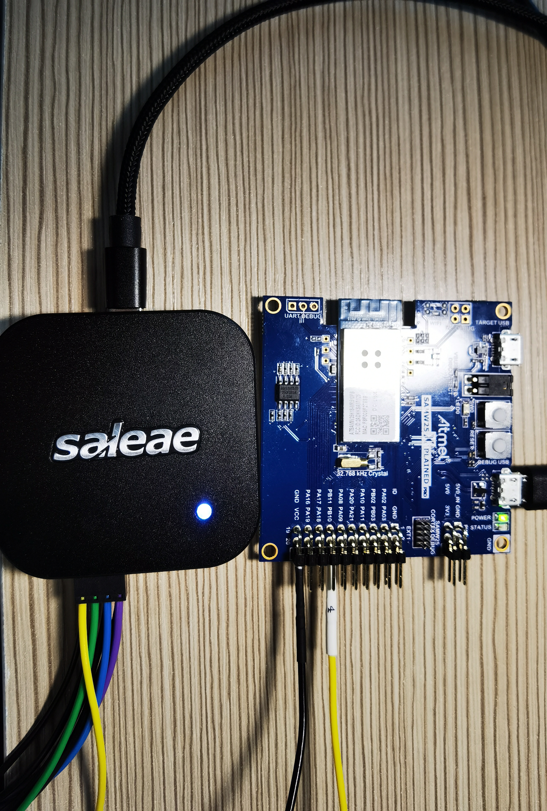
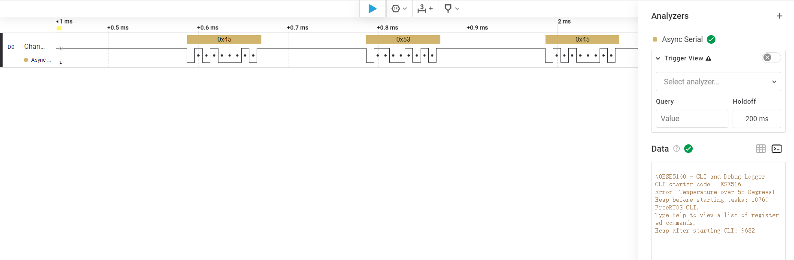

# a07g-exploring-the-CLI

* Team Number: T23
* Team Name: Good Night
* Team Members: Zeng Li, Haichao Zhao
* GitHub Repository URL: https://github.com/ese5160/final-project-a07g-a14g-t23-good-night.git
* Description of test hardware: Laptop, ROG M16, windows11

## 0. Install Percepio


## 1. Software Architecture
### 1.1 Hardware Requirements Specification (HRS)
#### 1.1.1 Overview
The Electronic Pet is a kind of desktop product, entertaining users in their daily life. It is controlled by MCU: SAMD21G, able to display real-time clock based on RTC chip, moving around with wheels controlled by mobile app or human voice, etc.

#### 1.1.2 Users
Primary users of this project include:
* Technology enthusiasts interested in innovative human-computer interaction
* Individuals seeking a more engaging and entertaining way to interact with their computers
  
#### 1.1.3 Definitions, Abbreviations
* Micro Controller Unit: MCU
* Organic Light Emitting Diode: OLED
* Real Time Clock: RTC

#### 1.1.4 Functionality
* HRS 01 - Project shall be based on SAMW25 microcontroller.
* HRS 02 - A 39x41x3.3mm OLED shall be used as user interface. 
* HRS 03 - The Electronic Pet shall move around with wheels controlled by PWM signals(≥20kHz frequency).
* HRS 04 - The project shall utilize a microphone to capture users' voice command.
* HRS 05 - The project shall utilize a speaker to play audio signals.
* HRS 06 - The Electronic Pet shall have colorful lightning effect by using led strips based on I/O pins sending color data.
* HRS 07 - The Electronic Pet shall using 1-cell Li-Po battery with normal voltage 3.7V to power itself.
* HRS 08 - The Elctronic Pet shall have a hardware audio weak-up button to activate voice detection functionality.
* HRS 09 - The Elctronic Pet shall have a switch to allow firmware downloaded between MCU and AI voice module.
* HRS 10 - The Elctronic Pet shall have a reset button to reset MCU.
  
### 1.2. Software Requirements Specification (SRS)
#### 1.2.1 Overview
The Electronic Pet is a kind of desktop product, entertaining users in their daily life. It can show animations (including music animation, counting down animation, etc.) in the OLED. It has programmable light show and can communicate with users by voice.

#### 1.2.2 Users
Primary users of this project include:
* Technology enthusiasts interested in innovative human-computer interaction
* Individuals seeking a more engaging and entertaining way to interact with their computers

#### 1.3.3 Definitions, Abbreviations
* Micro Controller Unit: MCU
* Organic Light Emitting Diode: OLED

#### 1.4.4 Functionality
* SRS 01 - The OLED shall show real time clock with time changing animation under idle mode.
* SRS 02 - The Electronic Pet shall count down time, set by users' voice command(all voice ommand response time ≤100ms and all voice recognition accuracy ≥95%).
* SRS 03 - The OLED shall show time counting down changing animation.
* SRS 04 - The project shall control LED strip to display several modes: blinking with one color in 0.5 milisecond period, holding in one color, holding in multiple colors.
* SRS 05 - The Electronic Pet shall move forward, move backward, turn left and turn right based on users' voice command or mobile application control.
* SRS 06 - The Electronic Pet shall remind users to take breaks (OLED displaying animation for 10 seconds) and play a light show when 30 minutes counting down ends.
* SRS 07 - The Electronic Pet shall recognize and answer users' voice commands in 3 seconds after recieving voice activation commands.
* SRS 08 - The OLED display shall communicate with MCU via SPI bus(≥10MHz) and display refresh rate ≥30fps.
* SRS 09 - The microphone shall send signals to AI module via I2S bus(Audio sampling rate ≥44.1kHz).
* SRS 10 - The speaker shall communicate with AI module via PWM/DAC signals.

### 1.3 Software Architecture Diagram
<div align="center">
  
</div>

### 1.4 Flowchart/State Machine Diagram
<div align="center">
  
</div>

## 2. Understanding the Starter Code
### 1. InitializeSerialConsole() Function
`InitializeSerialConsole()` initializes the UART communication system with the following steps:
- Initializes two circular buffers for receiving and transmitting characters
- Configures the USART hardware
- Sets up callbacks for USART read/write operations
- Sets the interrupt priority
- Starts an initial read buffer job to begin receiving characters

`cbufRx` and `cbufTx` are handles to circular buffer data structures. These are FIFO (First-In-First-Out) buffers that allow efficient character transfer with automatic wraparound when the buffer reaches its limit.

### 2. Circular Buffer Initialization
The circular buffers are initialized using the `circular_buf_init` function:
```c
cbufRx = circular_buf_init((uint8_t *)rxCharacterBuffer, RX_BUFFER_SIZE);
cbufTx = circular_buf_init((uint8_t *)txCharacterBuffer, TX_BUFFER_SIZE);
```

The circular buffer library is defined in `circular_buffer.c` by Phillips Johnston, which implements a circular buffer data structure with functions for adding and removing elements.

### 3. Character Array Storage
The character arrays for the circular buffers are:
- `rxCharacterBuffer` - Size: 512 bytes (defined by RX_BUFFER_SIZE)
- `txCharacterBuffer` - Size: 512 bytes (defined by TX_BUFFER_SIZE)

These arrays are declared as global variables in SerialConsole.c:
```c
char rxCharacterBuffer[RX_BUFFER_SIZE];
char txCharacterBuffer[TX_BUFFER_SIZE];
```

### 4. UART Interrupt Definition
The UART interrupts are defined in the ASF (Atmel Software Framework) within the `_usart_interrupt_handler` function in `usart_interrupt.h/c`. This function handles all SERCOM USART interrupt events.

The interrupt mechanism works as follows:
- Hardware generates interrupts
- ASF routes these to `_usart_interrupt_handler`
- Handler checks which interrupt flag is set (RXC, DRE, or TXC)
- Based on the flag, it calls the appropriate registered callback function

The application connects to these interrupts by registering callbacks in `configure_usart_callbacks()`.

### 5. Callback Functions
The callback functions for UART operations are:

a. For receiving a character (RX):
   - `usart_read_callback` is called when a character is received

b. For sending a character (TX):
   - `usart_write_callback` is called when a character has been sent

### 6. Callback Function Operations
a. `usart_read_callback`:
   This function is marked incomplete ("ToDo") in the code. It should:
   - Get the received character from `latestRx`
   - Add it to the RX circular buffer (`cbufRx`) using `circular_buf_put()`
   - Start a new read operation to receive the next character

b. `usart_write_callback`:
   When a character has been transmitted, this function:
   - Checks if there are more characters in the TX circular buffer (`cbufTx`) 
   - If so, retrieves the next character and stores it in `latestTx`
   - Starts a new transmission
   - Continues until the circular buffer is empty

### 7. UART Receive Flow Diagram
```
User types a character
     ↓
Hardware UART receives character
     ↓
USART RXC interrupt is triggered
     ↓
_usart_interrupt_handler processes the interrupt
     ↓
Character is read from USART DATA register
     ↓
usart_read_callback() is called
     ↓
Character should be stored in cbufRx using circular_buf_put()
     ↓
New read operation is started with usart_read_buffer_job()
     ↓
Application retrieves character from cbufRx using SerialConsoleReadCharacter()
```

## 8. UART Transmission Flow Diagram
```
Application calls SerialConsoleWriteString("string")
     ↓
Characters are added to cbufTx using circular_buf_put()
     ↓
If UART is idle, first character is retrieved from cbufTx to latestTx
     ↓
usart_write_buffer_job() is called to send latestTx
     ↓
Transmission complete interrupt triggers
     ↓
usart_write_callback() is called
     ↓
Next character is retrieved from cbufTx to latestTx
     ↓
usart_write_buffer_job() is called again
     ↓
Process repeats until cbufTx is empty
     ↓
Characters appear on PC terminal
```

## 9. StartTasks() Function
The `StartTasks()` function:
- Prints the available heap size before starting tasks
- Creates the CLI task using `xTaskCreate(vCommandConsoleTask, "CLI_TASK", CLI_TASK_SIZE, NULL, CLI_PRIORITY, &cliTaskHandle)`
- Prints the available heap size after starting the CLI task

Only one thread is started: the Command Line Interface (CLI) task named "CLI_TASK".
## 3. Debug Logger Module
[Click here to see SerialConsole.c file.](https://github.com/ese5160/final-project-a07g-a14g-t23-good-night/blob/main/CLI%20Starter%20Code/src/SerialConsole/SerialConsole.c)

## 4. Wiretap the convo
> What nets must you attach the logic analyzer to? 
>> Sercom 4 nets

> Where on the circuit board can you attach / solder to?
>> PB10, PB11

> What are critical settings for the logic analyzer?
>> 1. PB10 is connected to one signal channel of the logic analyzer and GND pin in the board is connected to GND channel of the corresponding channel number of the logic analyzer.
>> 2. Enable Digital channel 0 in the Logic software.
>> 3. Choosing trigger pattern as rising edge.
>> 4. Choosing Async Serial in the Analyzers module of the Logic software.
>> 5. Choosing Data type as terminal.

<div align="center">
  
</div>

<div align="center">
  
</div>

[Click here for the captured file of a wiretapped conversation](A07G_Part4_Analyzer_Capture.sal)
## 5. Complete the CLI

## 6. Add CLI commands
