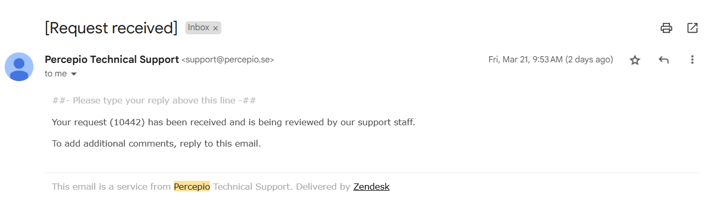

# a07g-exploring-the-CLI

* Team Number: T23
* Team Name: Good Night
* Team Members: Zeng Li, Haichao Zhao
* GitHub Repository URL: https://github.com/ese5160/final-project-a07g-a14g-t23-good-night.git
* Description of test hardware: Laptop, ROG M16, windows11

## 0. Install Percepio

## 1. Software Architecture

## 2. Understanding the Starter Code

## 3. Debug Logger Module

## 4. Wiretap the convo

## 5. Complete the CLI

## 6. Add CLI commands
